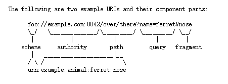
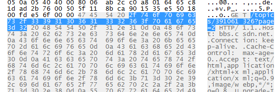
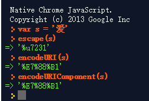
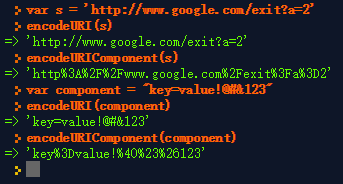

### URI编码

参考资料：[RFC 3986 Uniform Resource Identifier (URI): Generic Syntax](https://www.ietf.org/rfc/rfc3986.txt)

URI:

以下我们以URL为特例来介绍URI编码

首先，我们为什么要对URL进行编码呢? URL的长度有限，我们进行的不是压缩编码，那么这种编码的目的就是为了防止传输歧义。

当我们在浏览器中敲入某个URL的时候的，该URL就会别拆分成HOST、请求参数和协议请求地址在随着HTTP包在网络中传输。数据到达服务器后，服务器根据http传输过来的信息进行解析。看一个实际的http头：

选中部分就是URL中的目标地址和参数

其中，URL参数字符串中通过key=value的形式传递参数，而且value没有编程语言中字符串那样使用""包括。所以，如果value中包含了&或=，那么服务端就会解析错了，因此我们需要进行编码。同时为了使参数能正常解码，对于W3C中对于编码方式也有规定，需要将Unicode编码转换为ASCII码，比如中文。

保留字符（RFC3986 2.2）包括：

    reserved = gen-delims / sub-delims

    gen-delims  = ":" / "/" / "?" / "#" / "[" / "]" / "@"

    sub-delims  = "!" / "$" / "&" / "'" / "(" / ")"
                  / "*" / "+" / "," / ";" / "="

非保留字符包括：

    unreserved  = ALPHA / DIGIT / "-" / "." / "_" / "~"

javascript对于URI的解析有三个函数，分别是：

escape、encodeURI、encodeURIComponent

三者在安全字符（函数不会对这些字符进行编码）上不同

    escape（69个):               */@+-._0-9a-zA-Z 
    
    encodeURI（82个）:           !#$&’()*+,/:;=?@-._~0-9a-zA-Z 
    
    encodeURIComponent（71个）:  !’()*-._~0-9a-zA-Z

escape是javascript1.0的函数，其中涉及的unicode编码方式还是按照unicode的16进制保存的。然而， 2005年1月发布的RFC 3986，强制所有新的URI必须对未保留字符不加以百分号编码；其它字符要先转换为UTF-8字节序列, 然后对其字节值使用百分号编码。此前的URI不受此标准的影响。

所以，escape的unicode编码方式已经被废弃了。

我们看一下两者的不同：

关于encodeURI和encodeURIComponent的不同之处，两者的使用场景是不同的。encodeURI是用于对象是一个完整的的URI，所以它的安全字符就包括了整个URL的保留字符，从而编码出来的还是一个可以使用的完整URI,而对于encodeURIComponent来说，编码的是一个单独的组件，编码完成后需要进行再组合，所以就无需在安全字符中加入保留字符，组件中的保留字符需要进行编码。

