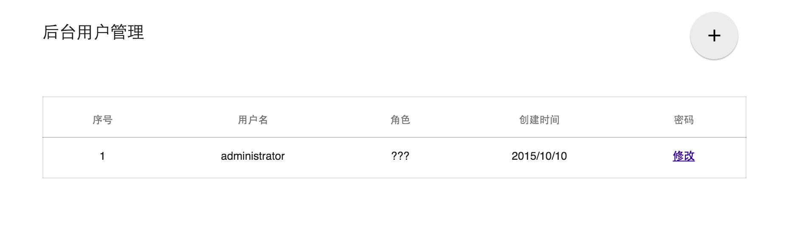
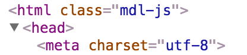
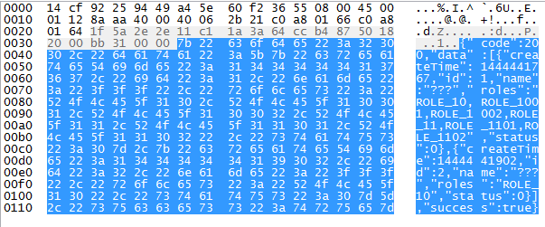
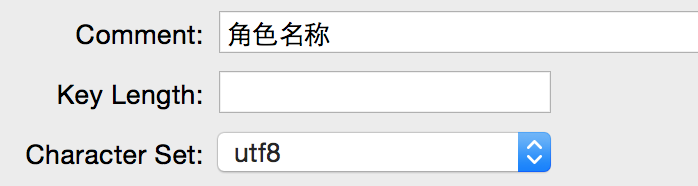
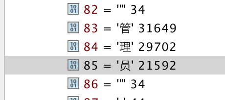
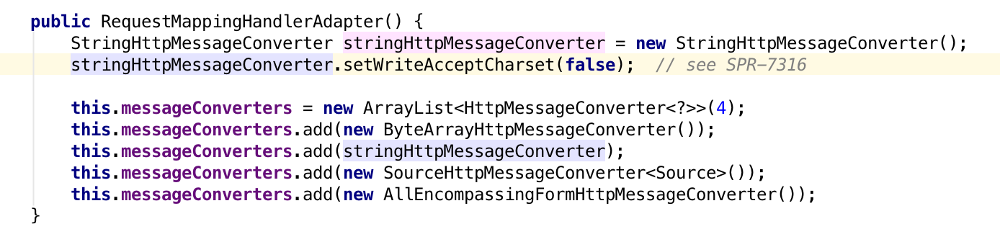
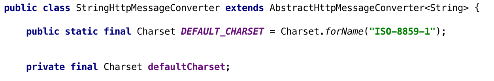
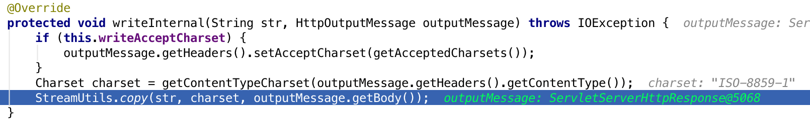

### 前后端编码问题解决

  最近在写一个小项目的后台，第一次使用spring mvc就遇到一个编码的问题。

  用户管理模块角色的权限“管理员”无法正常显示：

    

  很显然，是编码出现了问题，本来应该是统一成utf-8编码的，但是显然代码的某个地方没有正确转换编码。

  首先看一下，前端的编码已经通过<meta charset="utf-8">进行设置了。

   

  估计问题是出在后端的处理上，进一步确认问题，我们用wireshark抓一下这个ajax请求前端返回的http包：

  

  可以看到，“管理员”被编码成了“？？？”，只占一共只占3个字节，这与UTF-8编码中中文的字节数不符合。

  那么编码问题确定不是前端解析上了。

  剩下容易确定就是数据库，看下数据库的表结构：

  

  编码上没有问题，那么最终的问题应该是后端处理上的问题。

  考虑到后端是java的，有可能jvm的编码方式错误会导致servlet接口返回的数据编码方式错误。然而，jvm上的.class在通过javac生成之后编码默认就是Unicode，好像没有什么问题。

  不可能是ide编码的问题，因为“管理员”是从数据库里读进来的，不是写在ide文件里的。

  使用com.alibaba.fastjson最终序列化的String中编码没有问题：

  

  StringHttpMessageConverter

  查了别人SpringMVC中遇到的编码问题，看到在@ResponseBody注解的底层是通过HttpMessageConverter来进行HTTP包的封装。

  这是在RequestMappingHandlerAdapter中进行处理的：

    

  在StringHttpMessageConverter中的默认编码方式是ISO-8859-1：

  

  StringHttpMessageConverter中write的底层：

    

  在spring配置文件中进行设置：

        <bean class="org.springframework.web.servlet.mvc.method.annotation.RequestMappingHandlerAdapter">
            <property name="messageConverters">
                <list>
                    <bean class="org.springframework.http.converter.StringHttpMessageConverter">
                        <property name="supportedMediaTypes">
                            <list>
                                <value>text/html;charset=UTF-8</value>
                            </list>
                        </property>
                    </bean>
                </list>
            </property>
        </bean>

注：

unicode不只是2字节，unicode在后续版本中加入了17~21位的，中文对应的就是4字节。

