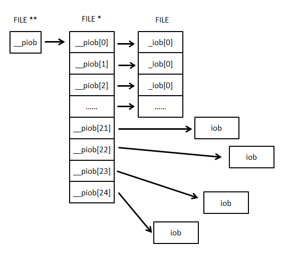

### 走进C标准库(2)——"stdio.h"中的fopen函数

  其他的库文件看起来没有什么实现层面的知识可以探究的，所以，直接来看stdio.h。

#### 1.茶余饭后的杂谈，有趣的历史

  在过去的几十年中，独立于设备的输入输出模型得到了飞速的发展，标准C从这个改善的模型中获益颇丰。

#### 输入输出模块

  在20世纪60年代早期，FORTRAN IV被认为是独立于机器的语言。但是如果不作任何改动，根本不可能在各种计算机体系结构中移动FORTRAN IV程序。可移植性的主要障碍是输入输出领域。在FORTRAN IV中，可以对FORTRAN IV代码中间的I/O语句中对正在通信的设备进行命名。CARD 和 INPUT TAPE就不一样。

  之后，逐渐发展到使用逻辑单元号（LUN）来代替具体的设备名，从而在可执行的二进制卡片之前加入控制卡片，从而指定某个特殊的运行过程那些设备与特定的LUN相对应。这时候，独立于设备的I/O时代来临了。

  设备独立的进一步改善得益于标准外围交换程序（peripheral interchange program,PIP)的进步。该程序允许指定源设备与目标设备的任意成，然后尽力执行两个设备之间的拷贝操作。

  进入UNIX。UNIX对所有文本流采用了标准内部形式，文本的每一行以换行符终止。这正是程序读入文本时所期望的，也是程序输出所产生的。假如这样的约定不能满足和UNIX机器相连的处理文本的外围设备的需求，可以在系统的对外接口有些修改，不必修改任何内部代码。UNIX提供了两种机制来修正“对外接口”的文本流。首先的是一个通用的映射函数，它可以用任意的文本处理设备工作。可以用系统调用ioctl来设置或者测试一个具体设备的的各种参数。另一个修正文本流的机制是修改直接控制该设备的专门软件。对于每一个UNIX可能需要控制的设备来说，用户必须添加一个常驻UNIX的设备管理器。

  当第一个C编译器在UNIX平台上运行时，C语言就自然地继承了它的宿主操作系统简单的I/O模型。除了文本流的统一表示，还有其他一些优点。很久以前使用的LUNs在最近几十年也慢慢地演变为称为文件描述符或句柄的非常小的正整数。操作系统负责分发文件描述符。并且把所有的文件控制信息存储在自己的专用内存中，而不是让用户去分配和维持文件和记录控制块以加重负担。

  为了简化多数程序的运行管理，UNIX shell分配给每个运行的程序3个标准文件描述符，这些就是现在普通使用的标准输入、标准输出和标准错误流。（文本流）

  UNIX不会阻止向任意打开的文件写入任意的二进制编码，或者从一个足够大的地方把它们丝毫不变地读取出来。（二进制流）

  所以，UNIX消除了文本流（与人通信）和二进制流（与机器通信）之间的区别。

  在相同的实现下，从一个二进制流读入的数据应该和之前写入到这个liu的数据相同，而文本流则不是。

  关于文本流和二进制流的[参考资料](http://www.embedu.org/Column/Column186.htm)，有助于理解概念。

  PS：流是一个操作系统层面的高度抽象的概念，它隐藏了I/O设备具体的实质，而将所有的I/O带来的数据变化看做输入的流入和流出，这样，在操作系统层面为程序将各种I/O设备模拟成流的样式，已经使这时的I/O模块独立而抽象了。可以看到，I/O模型发展的过程，就是其逐渐抽象统一的过程，这一点与语言的发展的历程是相似的。

  X3J11委员会在1983年开始召开会议为C起草ANSI标准。非UNIX系统的C厂商和那些UNIX用户之间争论了很长时间，因为UNIX用户不能理解I/O为什么要这么麻烦（显然，UNIX的文件结构和设备的管理机制保证了I/O模块的简洁性，这是相对于其他操作系统的优点）。这是一个很有教育意义的过程，这些争论的一个重要的副产品就是更清楚地阐明了C支持的I/O模块。

  最终，委员会经过讨论整洁的重要性和向下兼容的重要性之后，决定抛弃UNIX风格的原语。（主要平衡代码效率和代码简洁性）

#### 2.不识庐山真面露，包含的内容

  类型：

FILE    它是一个对象类型，可以记录控制流需要的所有信息，包括它的文件定位符、指向相关缓冲（如果有的话）的指针、记录是否发生了读/写错误的错误提示符和记录文件手否结束的文件结束符（* 用来控制流的FILE对象的地址可能很重要，不必使用FILE对象的副本来代替原始的对象进行服务。*）

库中的函数分两类：

1.针对任意流的操作；

2.指定特定问文件流的操作；

两者分别又有读写、文件定位、缓冲区控制等操作，可以完成对流的全方位操作，只要你能想到。

#### 3.不畏浮云遮望眼，看实现吧

有两种设计决策对<stdio.h>的实现非常关键：

数据结构FILE的内容
与操作系统相互作用以执行实际输入/输出的低级原语

类型FILE：

---

(此处纯为个人理解，不为原书内容)

不管是二进制流还是文本流，C都是将文件当做连续的字节流在处理。该字节流的信息以及文件对应的文件描述符等都是需要存储在FILE类型中的内容。

    typedef struct _iobuf {
        char *_ptr; 
        int _cnt; 
        char *_base; 
        int _flag; 
        int _file; 
        int _charbuf; 
        int _bufsiz; 
        char *_tmpfname;
    }FILE;

虽然不知道这些个变量是什么意思，但看一下一些函数的实现可以勉强猜一猜。

##### FOPEN

    FILE * __cdecl _tfsopen (
        const _TSCHAR *file,
        const _TSCHAR *mode
        ,int shflag
        )
    {
            REG1 FILE *stream;
            REG2 FILE *retval;

            _ASSERTE(file != NULL);
            _ASSERTE(*file != _T('\0'));
            _ASSERTE(mode != NULL);
            _ASSERTE(*mode != _T('\0'));

            /* Get a free stream */
            /* [NOTE: _getstream() returns a locked stream.] */

            if ((stream = _getstream()) == NULL)
                    return(NULL);

            /* open the stream */
    #ifdef _UNICODE
            retval = _wopenfile(file,mode,shflag,stream);
    #else  /* _UNICODE */
            retval = _openfile(file,mode,shflag,stream);
    #endif  /* _UNICODE */

            /* unlock stream and return. */
            _unlock_str(stream);
            return(retval);
    }

其中FILE *类型变量通过_getstream()获得。所以，我们可以稍微看下_getstream()的实现。不过在看_getstream()的实现之前，有必要介绍C标准库中关于IO控制块（即FILE文件）的管理机制：

首先，在I/O控制块中有三个特殊的控制块，分别是标准输入、标准输出和标准错误流。其中标准输入有其输入大小的限制。

    #define _INTERNAL_BUFSIZ 4096
    char _bufin[_INTERNAL_BUFSIZ]; //标准输入流使用的存储单元
      

可以看到我使用的这个版本的C标准库中，标准输入流的大小为：4096。我们可以简单用代码测试一下：

    int main(void)
    {
        int i;
        char s[10000];
        for( i = 0; i < 10000; i++ )
            s[i] = 0;
        scanf("%s",s);
        for(i = 0; i < 10000; i++ ){
            if( s[i] == 0){
                printf("%d",i+1);
                break;
            }
        }
        return 0;
    }

输入为5000个1，输出结果为：4095。应该是有一个结束标志符的缘故。显然，那些超出_INTERNAL_BUFSIZ的字符串部分被舍去了。

该C标准库中，这个I/O控制块通过一个FILE数组_iob和一个FILE **指针来进行管理。如下：

代码块1：

    #ifdef _WIN32
    #define _NSTREAM_   512
    /*
     - Number of entries in _iob[] (declared below). Note that _NSTREAM_ must be
     - greater than or equal to _IOB_ENTRIES.
     */
    #define _IOB_ENTRIES 20
    #else  /* _WIN32 */
    #ifdef CRTDLL
    #define _NSTREAM_   128         /* *MUST* match the value under ifdef _DLL! */
    #else  /* CRTDLL */
    #ifdef _DLL
    #define _NSTREAM_   128
    #else  /* _DLL */
    #ifdef _MT
    #define _NSTREAM_   40
    #else  /* _MT */
    #define _NSTREAM_   20

代码块2：

    FILE _iob[_IOB_ENTRIES] = {
        /* _ptr, _cnt, _base,  _flag, _file, _charbuf, _bufsiz */
        /* stdin (_iob[0]) */
        { _bufin, 0, _bufin, _IOREAD | _IOYOURBUF, 0, 0, _INTERNAL_BUFSIZ },
        /* stdout (_iob[1]) */
        { NULL, 0, NULL, _IOWRT, 1, 0, 0 },
        /* stderr (_iob[3]) */
        { NULL, 0, NULL, _IOWRT, 2, 0, 0 },
    };

代码块3：

    #ifdef CRTDLL
    int _nstream = _NSTREAM_;
    #else  /* CRTDLL */
    int _nstream;
    #endif  /* CRTDLL */
    　void ** __piob;
     if ( (__piob = (void **)_calloc_crt( _nstream, sizeof(void *) )) == NULL ) {
                _nstream = _IOB_ENTRIES;
                if ( (__piob = (void **)_calloc_crt( _nstream, sizeof(void *))) == NULL )
                    _amsg_exit( _RT_STDIOINIT );
     }
    for ( i = 0 ; i < _IOB_ENTRIES ; i++ )
                __piob[i] = (void *)&_iob[i];

从代码块2中我们可以看到，FILE _iob[_IOB_ENTRIES]是一个FILE数组，其中预设了三种FILE类型，分别是stdin,stdout和stderr。因为不同平台下，I/O控制块数量的大小至少为20（从_NSTREAM_的定义看出），所以_IOB_ENTRIES定义为20，作为前20个I/O控制块。此处的值是不是20其实没有什么意义，只要这个数组能容纳下3个预设的I/O控制块，同时大小至于产生浪费空间的可能即可（大于20就有可能浪费）。

__piob是一个FILE **的二维指针，管理着一个FILE *的指针数组，用来指向陆续分配的I/O控制块的地址，这个指针数组的大小最大为_NSTREAM_ = 512，可以测试一下这个数值。

    #include <stdlib.h>
    #include <stdio.h>

    int main(void)
    {
        FILE *p[600];
        char file_name[10];
        for(int i = 0; i < 600; i++){
            itoa(i,file_name,10);
            p[i] = fopen(file_name,"w");
        }
        for(int i = 0; i< 600; i++)
            fclose(p[i]);
        return 0;
    }

可以看到在文件夹中建立了509个文件，加上预置的stdin、stdout、stderr正好为512个。

管理方式如图：

现在，我们将目光移回，看下_getstream()的实现：

    FILE * __cdecl _getstream (
            void
            )
    {
            REG2 FILE *retval = NULL;

    #ifdef _WIN32

            REG1 int i;

            /* Get the iob[] scan lock */
            _mlock(_IOB_SCAN_LOCK);

            /*
             - Loop through the __piob table looking for a free stream, or the
             - first NULL entry.
             */
            for ( i = 0 ; i < _nstream ; i++ ) {

                if ( __piob[i] != NULL ) {
                    /*
                     - if the stream is not inuse, return it.
                     */
                    if ( !inuse( (FILE *)__piob[i] ) ) {
    #ifdef _MT
                        _lock_str2(i, __piob[i]);

                        if ( inuse( (FILE *)__piob[i] ) ) {
                            _unlock_str2(i, __piob[i]);
                            continue;
                        }
    #endif  /* _MT */
                        retval = (FILE *)__piob[i];
                        break;
                    }
                }
                else {
                    /*
                     - allocate a new _FILEX, set _piob[i] to it and return a
                     - pointer to it.
                     */
                    if ( (__piob[i] = _malloc_crt( sizeof(_FILEX) )) != NULL ) {

    #if defined (_MT)
                        InitializeCriticalSection( &(((_FILEX *)__piob[i])->lock) );
                        EnterCriticalSection( &(((_FILEX *)__piob[i])->lock) );
    #endif  /* defined (_MT) */
                        retval = (FILE *)__piob[i];
                    }

                    break;
                }
            }

            /*
             - Initialize the return stream.
             */
            if ( retval != NULL ) {
                retval->_flag = retval->_cnt = 0;
                retval->_tmpfname = retval->_ptr = retval->_base = NULL;
                retval->_file = -1;
            }

            _munlock(_IOB_SCAN_LOCK);

    #else  /* _WIN32 */
    #if defined (_M_MPPC) || defined (_M_M68K)

            REG1 FILE *stream = _iob;

            /* Loop through the _iob table looking for a free stream.*/
            for (; stream <= _lastiob; stream++) {

                    if ( !inuse(stream) ) {
                            stream->_flag = stream->_cnt = 0;
                            stream->_tmpfname = stream->_ptr = stream->_base = NULL;
                            stream->_file = -1;
                            retval = stream;
                            break;
                    }
            }

    #endif  /* defined (_M_MPPC) || defined (_M_M68K) */
    #endif  /* _WIN32 */

            return(retval);
    }

显然，在仍有FILE*指针可用的情况下，为第一个空闲的FILE *分配一片对应的FILE空间。即将新的stream纳入到了整个I/O控制块的管理中。

OK，我们再回到fopen函数中，在得到一个没有使用过的I/O控制块之后，显然下一步要做的就是对这个I/O块，根据设定的模式进行配置。此时，要调用到的就是_openfile函数。

在_openfile中，需要标记了stream._flag = streamflag;streamflag通过位标记了_IOREAD、_IOWRT当前所进行操作的类型。stream._file得到了一个int类型的文件描述符（通过更底层的open系列函数建立了文件描述符，同时决定了该数据流是文本流还是二进制流）。

那么，我们可以得到FILE中两个变量的意义了。

过了一天，回过头来，我觉得有必要深究一下_openfile，看看底层的C标准库是如何调用WINAPI确定文件描述符，从而实现流的，这对于后面深入了解其他函数的实现有帮助。

    FILE * __cdecl _openfile (
         const _TSCHAR *filename,
            REG3 const _TSCHAR *mode,
            int shflag,
            FILE *str
            )
    {
            REG2 int modeflag;
            int streamflag = _commode;
            int commodeset = 0;
            int scanset    = 0;
            int whileflag;
            int filedes;
            REG1 FILE *stream;

            _ASSERTE(filename != NULL);
            _ASSERTE(mode != NULL);
            _ASSERTE(str != NULL);

            /* Parse the user's specification string as set flags in
                   (1) modeflag - system call flags word
                   (2) streamflag - stream handle flags word. */

            /* First mode character must be 'r', 'w', or 'a'. */

            switch (*mode) {
            case _T('r'):
                    modeflag = _O_RDONLY;
                    streamflag |= _IOREAD;
                    break;
            case _T('w'):
                    modeflag = _O_WRONLY | _O_CREAT | _O_TRUNC;
                    streamflag |= _IOWRT;
                    break;
            case _T('a'):
                    modeflag = _O_WRONLY | _O_CREAT | _O_APPEND;
                    streamflag |= _IOWRT;
                    break;
            default:
                    return(NULL);
                    break;
            }

            /* There can be up to three more optional mode characters:
               (1) A single '+' character,
               (2) One of 't' and 'b' and
               (3) One of 'c' and 'n'.
            */

            whileflag=1;

            while(*++mode && whileflag)
                    switch(*mode) {

                    case _T('+'):
                            if (modeflag & _O_RDWR)
                                    whileflag=0;
                            else {
                                    modeflag |= _O_RDWR;
                                    modeflag &= ~(_O_RDONLY | _O_WRONLY);
                                    streamflag |= _IORW;
                                    streamflag &= ~(_IOREAD | _IOWRT);
                            }
                            break;

                    case _T('b'):
                            if (modeflag & (_O_TEXT | _O_BINARY))
                                    whileflag=0;
                            else
                                    modeflag |= _O_BINARY;
                            break;

                    case _T('t'):
                            if (modeflag & (_O_TEXT | _O_BINARY))
                                    whileflag=0;
                            else
                                    modeflag |= _O_TEXT;
                            break;

                    case _T('c'):
                            if (commodeset)
                                    whileflag=0;
                            else {
                                    commodeset = 1;
                                    streamflag |= _IOCOMMIT;
                            }
                            break;

                    case _T('n'):
                            if (commodeset)
                                    whileflag=0;
                            else {
                                    commodeset = 1;
                                    streamflag &= ~_IOCOMMIT;
                            }
                            break;

                    case _T('S'):
                            if (scanset)
                                    whileflag=0;
                            else {
                                    scanset = 1;
                                    modeflag |= _O_SEQUENTIAL;
                            }
                            break;

                    case _T('R'):
                            if (scanset)
                                    whileflag=0;
                            else {
                                    scanset = 1;
                                    modeflag |= _O_RANDOM;
                            }
                            break;

                    case _T('T'):
                            if (modeflag & _O_SHORT_LIVED)
                                    whileflag=0;
                            else
                                    modeflag |= _O_SHORT_LIVED;
                            break;

                    case _T('D'):
                            if (modeflag & _O_TEMPORARY)
                                    whileflag=0;
                            else
                                    modeflag |= _O_TEMPORARY;
                            break;

                    default:
                            whileflag=0;
                            break;
                    }

            /* Try to open the file.  Note that if neither 't' nor 'b' is
               specified, _sopen will use the default. */

            if ((filedes = _tsopen(filename, modeflag, shflag, CMASK)) < 0)
                    return(NULL);
             stream = str;

            stream->_flag = streamflag;
            stream->_cnt = 0;
            stream->_tmpfname = stream->_base = stream->_ptr = NULL;

            stream->_file = filedes;

            return(stream);
    }

_openfile 函数接受4个参数，其中shflag是fopen函数调用_tfsopen 时设定的默认值为_SH_DENYNO，表示允许文件共享，允许其他线程或进程同时访问当前打开文件

_TSCHAR *filename,REG3 const _TSCHAR *mode,FILE *str分别为文件名，打开文件模式以及管理该文件的I/O控制块

基于参数mode进行的对于I/O控制块参数进行的配置就不深究了，我们关注一下文件描述符是如何诞生的，也就是下面这行代码：

    if ((filedes = _tsopen(filename, modeflag, shflag, CMASK)) < 0)

通过调用函数_tsopen，得到了相应的文件描述符。

观察这个调用，前3个参数与_openfile函数相同，最后一个参数CMASK是在创建文件时用于设定文件访问权限的（#define CMASK   0644    /* rw-r--r-- */）

进入_tsopen函数，喔，么么哒，WINAPI，终于看到你了。

    int __cdecl _tsopen (
            const _TSCHAR *path,
            int oflag,
            int shflag,
            ...
            )
    {

            int fh;                         /* handle of opened file */
            int filepos;                    /* length of file - 1 */
            _TSCHAR ch;                     /* character at end of file */
            char fileflags;                 /* _osfile flags */
            va_list ap;                     /* variable argument (pmode) */
            int pmode;
            HANDLE osfh;                    /* OS handle of opened file */
            DWORD fileaccess;               /* OS file access (requested) */
            DWORD fileshare;                /* OS file sharing mode */
            DWORD filecreate;               /* OS method of opening/creating */
            DWORD fileattrib;               /* OS file attribute flags */
            DWORD isdev;                    /* device indicator in low byte */
            SECURITY_ATTRIBUTES SecurityAttributes;

            SecurityAttributes.nLength = sizeof( SecurityAttributes );
            SecurityAttributes.lpSecurityDescriptor = NULL;

            if (oflag & _O_NOINHERIT) {
                SecurityAttributes.bInheritHandle = FALSE;
                fileflags = FNOINHERIT;
            }
            else {
                SecurityAttributes.bInheritHandle = TRUE;
                fileflags = 0;
            }

            /* figure out binary/text mode */
            if ((oflag & _O_BINARY) == 0)
                if (oflag & _O_TEXT)
                    fileflags |= FTEXT;
                else if (_fmode != _O_BINARY)   /* check default mode */
                    fileflags |= FTEXT;

            /*
             - decode the access flags
             */
            switch( oflag & (_O_RDONLY | _O_WRONLY | _O_RDWR) ) {

                case _O_RDONLY:         /* read access */
                        fileaccess = GENERIC_READ;
                        break;
                case _O_WRONLY:         /* write access */
                        fileaccess = GENERIC_WRITE;
                        break;
                case _O_RDWR:           /* read and write access */
                        fileaccess = GENERIC_READ | GENERIC_WRITE;
                        break;
                default:                /* error, bad oflag */
                        errno = EINVAL;
                        _doserrno = 0L; /* not an OS error */
                        return -1;
            }

            /*
             - decode sharing flags
             */
            switch ( shflag ) {

                case _SH_DENYRW:        /* exclusive access */
                    fileshare = 0L;
                    break;

                case _SH_DENYWR:        /* share read access */
                    fileshare = FILE_SHARE_READ;
                    break;

                case _SH_DENYRD:        /* share write access */
                    fileshare = FILE_SHARE_WRITE;
                    break;

                case _SH_DENYNO:        /* share read and write access */
                    fileshare = FILE_SHARE_READ | FILE_SHARE_WRITE;
                    break;

                default:                /* error, bad shflag */
                    errno = EINVAL;
                    _doserrno = 0L; /* not an OS error */
                    return -1;
            }

            /*
             - decode open/create method flags
             */
            switch ( oflag & (_O_CREAT | _O_EXCL | _O_TRUNC) ) {
                case 0:
                case _O_EXCL:                   // ignore EXCL w/o CREAT
                    filecreate = OPEN_EXISTING;
                    break;

                case _O_CREAT:
                    filecreate = OPEN_ALWAYS;
                    break;

                case _O_CREAT | _O_EXCL:
                case _O_CREAT | _O_TRUNC | _O_EXCL:
                    filecreate = CREATE_NEW;
                    break;

                case _O_TRUNC:
                case _O_TRUNC | _O_EXCL:        // ignore EXCL w/o CREAT
                    filecreate = TRUNCATE_EXISTING;
                    break;

                case _O_CREAT | _O_TRUNC:
                    filecreate = CREATE_ALWAYS;
                    break;

                default:
                    // this can't happen ... all cases are covered
                    errno = EINVAL;
                    _doserrno = 0L;
                    return -1;
            }

            /*
             - decode file attribute flags if _O_CREAT was specified
             */
            fileattrib = FILE_ATTRIBUTE_NORMAL;     /* default */

            if ( oflag & _O_CREAT ) {
                    /*
                     - set up variable argument list stuff
                     */
                    va_start(ap, shflag);
                    pmode = va_arg(ap, int);
                    va_end(ap);

                    if ( !((pmode & ~_umaskval) & _S_IWRITE) )
                            fileattrib = FILE_ATTRIBUTE_READONLY;
            }

            /*
             - Set temporary file (delete-on-close) attribute if requested.
             */
            if ( oflag & _O_TEMPORARY ) {
                fileattrib |= FILE_FLAG_DELETE_ON_CLOSE;
                fileaccess |= DELETE;
            }

            /*
             - Set temporary file (delay-flush-to-disk) attribute if requested.
             */
            if ( oflag & _O_SHORT_LIVED )
                fileattrib |= FILE_ATTRIBUTE_TEMPORARY;

            /*
             - Set sequential or random access attribute if requested.
             */
            if ( oflag & _O_SEQUENTIAL )
                fileattrib |= FILE_FLAG_SEQUENTIAL_SCAN;
            else if ( oflag & _O_RANDOM )
                fileattrib |= FILE_FLAG_RANDOM_ACCESS;

            /*
             - get an available handle.
             *
             - multi-thread note: the returned handle is locked!
             */
            if ( (fh = _alloc_osfhnd()) == -1 ) {
                errno = EMFILE;         /* too many open files */
                _doserrno = 0L;         /* not an OS error */
                return -1;              /* return error to caller */
            }

            /*
             - try to open/create the file
             */
            if ( (osfh = CreateFile( (LPTSTR)path,
                                     fileaccess,
                                     fileshare,
                                     &SecurityAttributes,
                                     filecreate,
                                     fileattrib,
                                     NULL ))
                 == (HANDLE)0xffffffff )
            {
                /*
                 - OS call to open/create file failed! map the error, release
                 - the lock, and return -1. note that it's not necessary to
                 - call _free_osfhnd (it hasn't been used yet).
                 */
                _dosmaperr(GetLastError());     /* map error */
                _unlock_fh(fh);
                return -1;                      /* return error to caller */
            }

            /* find out what type of file (file/device/pipe) */
            if ( (isdev = GetFileType(osfh)) == FILE_TYPE_UNKNOWN ) {
                CloseHandle(osfh);
                _dosmaperr(GetLastError());     /* map error */
                _unlock_fh(fh);
                return -1;
            }

            /* is isdev value to set flags */
            if (isdev == FILE_TYPE_CHAR)
                fileflags |= FDEV;
            else if (isdev == FILE_TYPE_PIPE)
                fileflags |= FPIPE;

            /*
             - the file is open. now, set the info in _osfhnd array
             */
            _set_osfhnd(fh, (long)osfh);

            /*
             - mark the handle as open. store flags gathered so far in _osfile
             - array.
             */
            fileflags |= FOPEN;
            _osfile(fh) = fileflags;

            if ( !(fileflags & (FDEV|FPIPE)) && (fileflags & FTEXT) &&
                 (oflag & _O_RDWR) )
            {
                /* We have a text mode file.  If it ends in CTRL-Z, we wish to
                   remove the CTRL-Z character, so that appending will work.
                   We do this by seeking to the end of file, reading the last
                   byte, and shortening the file if it is a CTRL-Z. */

                if ((filepos = _lseek_lk(fh, -1, SEEK_END)) == -1) {
                    /* OS error -- should ignore negative seek error,
                       since that means we had a zero-length file. */
                    if (_doserrno != ERROR_NEGATIVE_SEEK) {
                        _close(fh);
                        _unlock_fh(fh);
                        return -1;
                    }
                }
                else {
                    /* Seek was OK, read the last char in file. The last
                       char is a CTRL-Z if and only if _read returns 0
                       and ch ends up with a CTRL-Z. */
                    ch = 0;
                    if (_read_lk(fh, &ch, 1) == 0 && ch == 26) {
                        /* read was OK and we got CTRL-Z! Wipe it
                           out! */
                        if (_chsize_lk(fh,filepos) == -1)
                        {
                            _close(fh);
                            _unlock_fh(fh);
                            return -1;
                        }
                    }

                    /* now rewind the file to the beginning */
                    if ((filepos = _lseek_lk(fh, 0, SEEK_SET)) == -1) {
                        _close(fh);
                        _unlock_fh(fh);
                        return -1;
                    }
                }
            }

            /*
             - Set FAPPEND flag if appropriate. Don't do this for devices or pipes.
             */
            if ( !(fileflags & (FDEV|FPIPE)) && (oflag & _O_APPEND) )
                _osfile(fh) |= FAPPEND;

            _unlock_fh(fh);                 /* unlock handle */

            return fh;                      /* return handle */
    }

200多行的函数，让我们来看看如何利用WINAPI来生成文件描述符。

内部的一些参数，具体作用注释都很明显，挺好理解的。其中HANDLE osfh是该文件在操作系统层面管理的句柄，通过它就可以调用WINAPI函数来操作该文件。 SECURITY_ATTRIBUTES SecurityAttributes用于设定该文件句柄是否能够被子进程继承。 char fileflags用于表示读入文件的模式是文本流还是二进制流。int fh就是我们最后要返回的文件描述符。

跳过那些属性的参数设置，直接看WINAPI的调用。总共3步：

    fh = _alloc_osfhnd()

    osfh = CreateFile( (LPTSTR)path,fileaccess,fileshare,&SecurityAttributes,filecreate,fileattrib,NULL )

    _set_osfhnd(fh, (long)osfh);

    一个一个看下：

    /***
    *int _alloc_osfhnd() - get free _ioinfo struct
    *
    *Purpose:
    -       Finds the first free entry in the arrays of ioinfo structs and
    -       returns the index of that entry (which is the CRT file handle to the
    -       caller) to the caller.
    *
    *Entry:
    -       none
    *
    *Exit:
    -       returns index of the entry, if successful
    -       return -1, if no free entry is available
    *
    -       MULTITHREAD NOTE: IF SUCCESSFUL, THE HANDLE IS LOCKED WHEN IT IS
    -       RETURNED TO THE CALLER!
    *
    *Exceptions:

    *******************************************************************************/
    int __cdecl _alloc_osfhnd(
            void
            )
    {
            int fh = -1;    /* file handle */
            int i;
            ioinfo *pio;

            _mlock(_OSFHND_LOCK);   /* lock the __pioinfo[] array */

            /*
             - Search the arrays of ioinfo structs, in order, looking for the
             - first free entry. The compound index of this free entry is the
             - return value. Here, the compound index of the ioinfo struct
             - *(__pioinfo[i] + j) is k = i * IOINFO_ARRAY_ELTS + j, and k = 0,
             - 1, 2,... is the order of the search.
             */
            for ( i = 0 ; i < IOINFO_ARRAYS ; i++ ) {
                /*
                 - If __pioinfo[i] is non-empty array, search it looking for
                 - the first free entry. Otherwise, allocate a new array and use
                 - its first entry.
                 */
                if ( __pioinfo[i] != NULL ) {
                    /*
                     - Search for an available entry.
                     */
                    for ( pio = __pioinfo[i] ;
                          pio < __pioinfo[i] + IOINFO_ARRAY_ELTS ;
                          pio++ )
                    {
                        if ( (pio->osfile & FOPEN) == 0 ) {
                            pio->osfhnd = (long)INVALID_HANDLE_VALUE;
                            fh = i * IOINFO_ARRAY_ELTS + (pio - __pioinfo[i]);
                            break;
                        }
                    }

                    /*
                     - Check if a free entry has been found.
                     */
                    if ( fh != -1 )
                        break;
                }
                else {
                /*
                 - Allocate and initialize another array of ioinfo structs.
                 */
                if ( (pio = _malloc_crt( IOINFO_ARRAY_ELTS * sizeof(ioinfo) ))
                    != NULL )
                {

                    /*
                     - Update __pioinfo[] and _nhandle
                     */
                    __pioinfo[i] = pio;
                    _nhandle += IOINFO_ARRAY_ELTS;

                    for ( ; pio < __pioinfo[i] + IOINFO_ARRAY_ELTS ; pio++ ) {
                        pio->osfile = 0;
                        pio->osfhnd = (long)INVALID_HANDLE_VALUE;
                        pio->pipech = 10;
                    }

                    /*
                     - The first element of the newly allocated array of ioinfo
                     - structs, *(__pioinfo[i]), is our first free entry.
                     */
                    fh = i * IOINFO_ARRAY_ELTS;
                }

                break;
                }
            }

            _munlock(_OSFHND_LOCK); /* unlock the __pioinfo[] table */

            /*
             - return the index of the previously free table entry, if one was
             - found. return -1 otherwise.
             */
            return( fh );
    }

ioinfo是低级IO文件句柄的控制结构。

__pioinfo使用的是指针数组。其管理方式如下图：

猜想设计为二维数组的原因，较数组而言，不必明确地一次将所有空间分配完全，不至于造成空间的浪费。较链表而言，不至于因为调用太多次HeapAlloc从而造成效率上的损失。是一个存储空间和效率的平衡，从而较好地实现了下标到ininfo变量的映射。

fh返回的是刚分配的这个ioinfo变量是第几个。

下一步是得到osfh。

调用osfh = CreateFile( (LPTSTR)path,fileaccess,fileshare,&SecurityAttributes,filecreate,fileattrib,NULL )打开或创建文件，osfh接收到所创建的文件的句柄。

得到了fh，osfh，然后就是将两者建立映射关系，这样，我们对于FILE类中的文件描述符的操作，实质上就是对操作系统中的句柄列表中的句柄进行操作。

通过_set_osfhnd(fh, (long)osfh)，即可完成映射的建立。

    #define _osfhnd(i)  ( _pioinfo(i)->osfhnd )

---

    int __cdecl _set_osfhnd (
            int fh,
            long value
            )
    {
            if ( ((unsigned)fh < (unsigned)_nhandle) &&
                 (_osfhnd(fh) == (long)INVALID_HANDLE_VALUE)
               ) {
                if ( __app_type == _CONSOLE_APP ) {
                    switch (fh) {
                    case 0:
                        SetStdHandle( STD_INPUT_HANDLE, (HANDLE)value );
                        break;
                    case 1:
                        SetStdHandle( STD_OUTPUT_HANDLE, (HANDLE)value );
                        break;
                    case 2:
                        SetStdHandle( STD_ERROR_HANDLE, (HANDLE)value );
                        break;
                    }
                }

                _osfhnd(fh) = value;
                return(0);
            } else {
                errno = EBADF;      /* bad handle */
                _doserrno = 0L;     /* not an OS error */
                return -1;
            }
    }

到这里，fopen的过程就完全了。其中涉及到对于I/O控制块的管理以及对文件句柄的管理，之间有的映射关系，支持了fopen返回一个具有完整文件控制信息的FILE类。