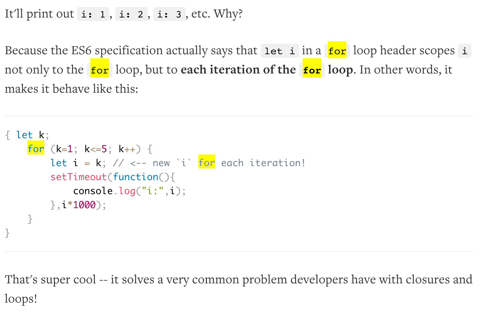

### es6体验(1)——let和const

解释器：[babel](https://babeljs.io/repl/) 或 [traceur](http://google.github.io/traceur-compiler/demo/repl.html)

  * 有了块级作用域了

    使用let，我们又重新有了块级作用域的概念，又可以些这样的代码了
    
        for( let i = 0; i < 2; i ++){
           for( let i = 0; i < 3; i++){
               console.log('inner : ' + i);
           }
           console.log('outer : ' + i);
         }
         
     现在循环执行inner输出6次了哦。

    另外，以for( let varible = x;;)的方式定义变量时，每次循环相当于使用let新建了一个变量，类似于每次循环是一个新的闭包，不同循环次数中的变量不会相互干扰。这点应该是为了与其他语言保持一致照顾代码可读性专门设计的。

        var a = [];
        for (let i = 0; i < 10; i++) {
          a[i] = function () {
            console.log(i);
          };
  const      }
        console.log(a[3]());  // 3

    使用babel翻译得到的es5代码为：

        "use strict";

        var a = [];

        var _loop = function (i) {
          a[i] = function () {
            console.log(i);
          };
        };

        for (var i = 0; i < 10; i++) {
          _loop(i);
        }

        console.log(a[3]());

    可以看到babel在解释的时候确实是新建了一个匿名函数作为闭包的。

    

    参考资料：[for and against let](http://davidwalsh.name/for-and-against-let)中的Always Explicit?章节。

  * 关于变量提升

        var v='Hello World';
        (function(){
            alert(v);
            var v='I love you';
        })()  

    上述代码由于变量提升会导致alert出来的是undefined。所谓变量提升就是将v的声明放在作用域的最前面。

    使用let不会发生变量提升，let定义的变量会与块级作用域绑定，从而在该作用域内定义变量之前对变量的调用都会抛出ReferenceError，如：

        var tmp = 123;

        if (trulete) {
          tmp = 'abc'; // ReferenceError
          let tmp;
        }

  * 有了常量

    const用于声明常量，也具有块级作用域。

    对const类型进行赋值不会改变它的值（可能失败）

    const必须有初始值。

    const对于应用于对象时指的是对象的地址不可变。使用Object.freeze可以彻底冻结对象。

有了let和const，感觉js代码的可读性和可维护性得到了增强。